# 🤖 Agentic PDLC Framework

[](https://opensource.org/licenses/MIT)
[](http://makeapullrequest.com)

> **Stop fighting your AI agents. Give them structure.**

**Agentic PDLC** is a lightweight, zero-dependency boilerplate that transforms chaotic AI coding into a deterministic, automated software assembly line.

It standardizes how your AI assistants (Claude, Cursor, Copilot, Jules) interpret tasks, respect invariants, and collaborate seamlessly from an idea to production.

<div align="center">
  
</div>

---

## ⚡ Why you need this

- 🧠 **One Contract to Rule Them All**: `AGENTS.md` is your single source of truth. Stop repeating yourself; let every AI read the same invariants.
- 🤖 **Automated Handoffs**: Move cards across your GitHub board with labels. Brainstorm with Claude upstream, let Jules code downstream.
- 🚀 **Interactive Setup**: Run one `npx` command and let your favorite AI assistant scaffold the framework into your project interactively.
- 📈 **Maturity Model**: A clear path from structured (Level 1) to semi-autonomous (Level 3) development. [Read the Agentic Maturity Model](docs/maturity-model.md).

---

## 🏗️ How It Works: The Two Scopes

The Agentic PDLC bridges the gap between high-level human ideas and deterministic AI execution. It splits the workflow into two clear phases:

### 🌊 1. Upstream (Idea → Spec)
You use conversational AI (e.g., **Claude Code**, **Cursor Chat**) as your brainstorming partner. Together, you flesh out user stories, acceptance criteria, and technical specifications until they are rock solid.

### 🏭 2. Downstream (Spec → Production)
Once the spec is approved, autonomous implementation agents (e.g., **Jules**, **Sweep**, **Copilot Workspace**) pick up the task via an automated GitHub Project board flow. They execute the deterministic specs while being strictly governed by your project's invariants.

---

## 🤝 Universal Multi-Assistant Support

The framework relies on a universal source of truth (`AGENTS.md`), but uses elegant adapters to teach specific AI platforms how to read them.

| AI Assistant | Instruction File | How it Integrates |
|:---|:---|:---|
| **Claude Code** | `CLAUDE.md` + Claude Skill | Uses `adapters/claude-code/skill.md` *(Includes Auto-Setup Mode)* |
| **Cursor** | `.cursor/rules/*.md` | Uses `adapters/cursor/rules.md` |
| **GitHub Copilot** | `.github/copilot-instructions.md` | Uses `templates/.github/copilot-instructions.md` |
| **Codex / Antigravity** | `AGENTS.md` | Reads the contract natively |

*No matter which AI you pair with, they will all share the exact same context.*

---

## 📂 Expected Structure

Once initialized in your project, the framework provides the following layout:

```text
your-project/
├── AGENTS.md                          ← The universal contract mapping rules to any AI.
├── docs/
│   └── pdlc.md                        ← The PDLC pipeline defining board columns and IDs.
└── .github/
    └── workflows/
        ├── project-automation.yml     ← Automates GitHub Project card movement.
        ├── agent-trigger.yml          ← Wakes up your agent upon `spec:approved`.
        └── ci.yml                     ← The Sentinel enforcing invariants and tests.
```

---

## 🚀 Quick Start

Ready to build at the speed of thought? Scaffold the entire framework interactively without copy-pasting code!

Simply run our installer in the root of your project:

```bash
npx create-agentic-pdlc
```

> **💡 How it works:** The CLI acts as a bridge. It asks which AI assistant you prefer (e.g., Claude Code, Cursor), drops the required system instructions into your workspace, and hands control over to your AI. Your AI will then chat with you to customize your framework!

---

## ❤️ Contributing

We welcome improvements from other solo-founders and AI-engineers! Please check our **[Contributing Guidelines](CONTRIBUTING.md)** on how to submit PRs, add new AI platform adapters, or improve the documentation.
