# PDLC Flow: From Idea to Production

This document describes the full lifecycle of a card on the agentic-pdlc board — who acts at each stage, what triggers each transition, which labels are added or removed, and where human gates are required.

```mermaid
stateDiagram-v2
    direction LR
    Idea --> Exploration : stage:exploration
    Exploration --> Brainstorming : stage:brainstorming
    Brainstorming --> Detailing : Gate 1 (PM)
    Detailing --> Approval : stage:approval
    Approval --> Development : Gate 2 (spec:approved)
    Development --> Testing : stage:testing
    Testing --> CodeReview : PR Opened
    CodeReview --> Production : Gate 3 (PR Merged)
```

---

## Roles

| Role | Responsibility |
|------|---------------|
| **PM** (human) | Selects issues for the sprint, approves brainstorm (Gate 1), approves spec (Gate 2) |
| **TL / Reviewer** (human) | Co-approves spec for technical decisions (Gate 2), reviews and approves the PR (Gate 3) |
| **Claude** | Exploration, brainstorming, spec writing — acts on PM instruction via chat or via upstream label |
| **Implementation Agent** | Implementation, running tests, opening the PR |
| **Workflow** | All label swaps and card movements — the source of truth for board state |

> **Principle:** Every board transition must be triggered by a GitHub event (label, PR, review) processed by a workflow. Agents must never be responsible for moving cards.

---

## Step-by-Step Flow

### 💡 Idea
Issue exists in the backlog with no `stage:` label.

---

### 🔍 Exploration

**Trigger (two equivalent paths):**
- PM tells Claude directly in chat → Claude adds `stage:exploration` to the issue, OR
- PM adds `stage:exploration` directly to the issue

**Workflow:** `project-automation.yml` detects `stage:exploration` → moves card to Exploration.

**Who works:** Claude reads relevant code and context.

---

### 🧠 Brainstorming

**Trigger:** Claude, after exploration.

**Actions:**
- Claude posts a comment on the issue with findings and 2–3 proposed approaches
- Claude swaps `stage:exploration` → `stage:brainstorming`

**Workflow:** `project-automation.yml` moves card to Brainstorming.

**⏸ Human gate (Gate 1 — PM):** PM reads the brainstorming comment and selects an approach. This can be done:
- By commenting on the issue (e.g., "Option A", "Go with B", "approved", "lgtm")
- By telling Claude in chat

**Note on implicit approval:** If Claude presented multiple options, selecting one (e.g., "Option A") counts as implicit approval. The `upstream-gate.yml` detects option-selection patterns in addition to explicit approval words.

---

### 📐 Detail Solution ← Gate 1

**Trigger:** `upstream-gate.yml` detects PM approval comment on a `stage:brainstorming` issue → swaps `stage:brainstorming` → `stage:detailing` via `PROJECT_TOKEN`.

**Who works:** Claude rewrites the issue body with:
1. User story (`As… I want… So that…`)
2. Acceptance Criteria (AC1, AC2, …)
3. Files to modify

**After spec is written:** Claude swaps `stage:detailing` → `stage:approval`.

**Workflow:** `project-automation.yml` moves card to Approval.

---

### ✅ Approval

**⏸ Human gate (Gate 2 — PM + TL):** Both PM (business decisions) and TL (technical decisions) review the spec. When both are satisfied, PM adds label `spec:approved`.

**Workflow:** `agent-trigger.yml` detects `spec:approved` →
1. Removes `stage:approval`
2. Adds `stage:development`
3. Adds specific agent label (e.g., `jules`)
4. Posts a structured comment with implementation instructions for the Agent

**Workflow:** `project-automation.yml` moves card to Development.

---

### ⚙️ Development

**Who works:** Implementation Agent implements the spec strictly within the Acceptance Criteria.

**When done:** Agent adds `stage:testing` before running tests.

**Workflow:** `project-automation.yml` moves card to Testing.

---

### 🧪 Testing

**Who works:** Agent runs the test suite (`vitest run` + `typecheck`).

**When tests pass:** Agent opens a PR with `Closes #N` in the body.

**Workflow:** `project-automation.yml` detects PR opened → moves linked issue to Code Review, adds `pr:in-review` label to the PR.

---

### 👁 Code Review ← Gate 3

**⏸ Human gate (Gate 3 — TL / PM):** Reviewer reads the PR, verifies ACs, checks for regressions.

**Trigger:** Reviewer approves the PR via GitHub's native review interface (no label needed).

**Workflow:** `project-automation.yml` detects `pull_request_review: approved` → moves card to Production upon merge. Adds `pr:approved` label to the PR.

---

### 🚀 Production

**Who acts:** PM or TL merges the PR.

**Workflow:** `project-automation.yml` detects PR merged → moves card to Production.

> **Note:** There is no separate "Merge" column. Review and merge happen in tight sequence in practice, and a transient column adds no visibility value.

---

## Label Reference

| Label | Added by | Removed by |
|-------|----------|------------|
| `stage:exploration` | PM (human) or Claude | Claude |
| `stage:brainstorming` | Claude | `upstream-gate.yml` |
| `stage:detailing` | `upstream-gate.yml` | Claude |
| `stage:approval` | Claude | `agent-trigger.yml` |
| `stage:development` | `agent-trigger.yml` | Impl. Agent |
| `stage:testing` | Impl. Agent | `project-automation.yml` (on PR open) |
| `spec:approved` | PM (human) | — |
| `agent_label` (e.g. `jules`, `sweep`) | `agent-trigger.yml` | — |
| `pr:in-review` | `project-automation.yml` | `project-automation.yml` |
| `pr:approved` | `project-automation.yml` | — |

---

## Human Gates Summary

| Gate | Who | Trigger | What they decide |
|------|-----|---------|-----------------|
| **Gate 1** | PM | Comment on brainstorming issue | Which approach to pursue |
| **Gate 2** | PM + TL | Add `spec:approved` label | Whether the spec is correct and complete |
| **Gate 3** | TL / PM | GitHub PR review approval | Whether the implementation meets the ACs |

---

## Known Risk: Autonomous Agents and Informal Comments

Implementation agents often monitor issue comments and can act on informal instructions (e.g., "@agent fix this") — bypassing Gates 1 and 2. This behavior is controlled by the agent's platform and cannot be prevented via GitHub Actions.

**Mitigation:** The effective code quality gate is Gate 3 (PR review + mandatory CI). Never comment directly on issues to instruct the agent outside the `spec:approved` flow.

See [issue #11](https://github.com/rafaeltcosta86/agentic-pdlc/issues/11) for full context.
